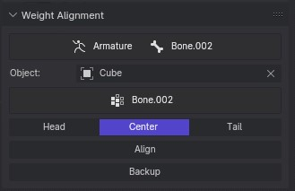

# Bone-vertex-weight-align

> Bone alignment by vertex weights

## Notas
- El addon funciona perfectamente y mucho mejor de lo que esperaba, los huesos se alinean a la malla de forma bastante perfecta
- Hay un problema con ARP que los huesos se alinean mediante Reference y estos no tienen ningún Vertex Group, se plantea arreglarlo pudiendo elegir libremente el vertex group y no limitar al del hueso asignado
- Align by "CENTER" da los mejores resultados
- Tras alinear con "CENTER" estoy pensando añadir una opción que se activa y se ejecuta al hacer clic sobre "Align" llamado "Connect with parent" y básicamente juntará el Head del hueso y el Tail del padre siendo la distancia la mitad de su magnitud de ambos
- El operador "bone.weight_alignment" tiene un backup y pensando en reutilizar este operador en otros complementos, se creará un booleano llamado "backup_on" porque actualmente es necesario crear tres variables de escena para el backup, aunque lo ideal sería almacenar el backup en una lista y así poder hacer backup tras un "batch" osea alinear masivamente y si se quiere volver atrás
- Quiero crear una opción de treshold que básicamente y tras haber alineado el hueso (ejecutado el operador) y haciendo uso del backup poder desplazar la cabeza y el hueso en un slider de 0 a 1 desde su posición original hasta la nueva posición. Serán dos sliders, uno para head y otro para tail, por supuesto valores almacenables para el batch.
